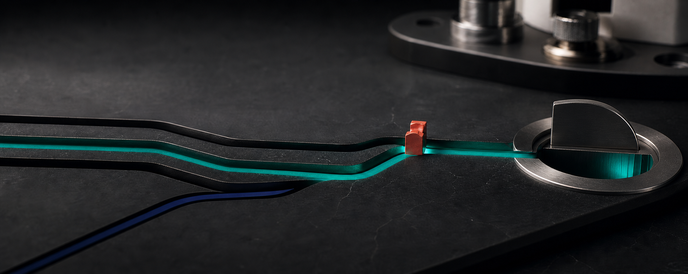

# Motion System

The launch-film grammar is a measured route resolving into an implementation.
It should feel editorial and exact, not cinematic for its own sake.

The still above establishes the material and lighting language. Production
video uses the same world at `1920×1080`, 24 fps, then moves to real product
footage and evidence after the identity sequence.

## Six-second identity intro

| Time | Beat | Visual |
|---:|---|---|
| `0.0–1.2 s` | Profile | Several thin workload paths enter an unresolved field |
| `1.2–2.8 s` | Select | One route becomes teal; all others remain graphite |
| `2.8–4.4 s` | Prove | A proof-red square locks to the measured junction; metadata appears |
| `4.4–5.4 s` | Integrate | The selected path enters a solid paper or carbon implementation block |
| `5.4–6.0 s` | Sign | Jinstone mark, literal release title, evidence level |

## Motion tokens

- Master: `1920×1080`, `24 fps`, progressive.
- Route draw: `1.2 s`.
- Default easing: `cubic-bezier(0.22, 1, 0.36, 1)`.
- Metric hold: at least `1.5 s` before a cut.
- Text enters by mask or hard cut; no bounce, overshoot, or typewriter effect.
- Camera remains fixed unless real product footage requires a physical move.
- Use one quiet mechanical transient for the measurement lock. Music is
  optional; the system must work silently.

## Shot order after the intro

1. Real product or instrument state.
2. Workload and baseline.
3. Mechanism: route, instruction, block, or control path.
4. Before/after result with units.
5. Repeatability and failure state.
6. Claim boundary and artifact link.

## Prohibited motion

- Generic particles, data rain, neural-network meshes, and glowing orbs.
- Fabricated die shots or board renders presented as the product.
- Numbers animating to a value that is not present in raw evidence.
- Rapid montages that hide the device, conditions, or failure cases.
- Logo animation longer than the evidence shot.

The logo is composited from its canonical source after image generation. It is
never generated inside a frame.
