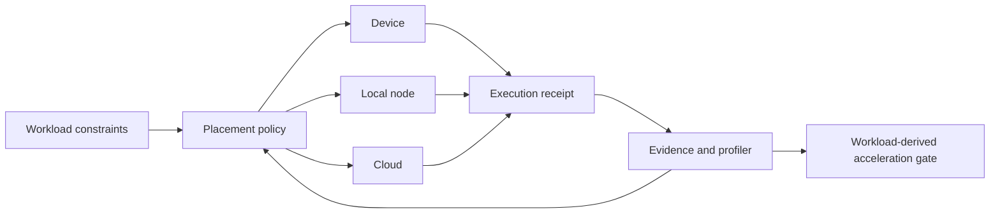

<div align="center">


<h1>JINSTONE · 径石</h1>

**Local AI Compute: run AI where it belongs. Build silicon when the workload demands it.**

径石从 Local AI Compute 开始，让 AI workload 在设备、本地算力节点或云端按约束真实执行，
再让反复出现的瓶颈决定是否进入专用计算与芯片。

[Product loop](#product-loop) · [Current evidence](#current-evidence) · [Next gate](#next-gate) · [Progress 001](../docs/progress/2026-07-15-local-ai-compute.md)

<br />


</div>

## Thesis

AI is moving from a chat window into devices, vehicles, robots, private data,
and continuous workflows. The right execution location is not always the cloud,
and it is not always local.

Jinstone starts with the workload:

- What latency, privacy, quality, cost, availability, and failure constraints
  actually matter?
- Should this request run on the device, a local compute node, or the cloud?
- What happened when the selected path failed?
- Which bottleneck remains after software and existing hardware are exhausted?

> **Silicon is not the starting assumption. It has to earn its place.**

## Product loop

| Stage | Jinstone does | Literal output |
|---|---|---|
| **01 · Contract** | Capture the workload, data boundary, acceptance rules, and failure cost | Versioned workload contract |
| **02 · Place** | Mark device, local-node, and cloud routes eligible, blocked, or unmeasured | Explainable placement decision |
| **03 · Execute** | Run the chosen path and make fallback visible | Result + execution receipt |
| **04 · Learn** | Group repeatable evidence and profile the remaining bottleneck | Software / existing hardware / custom compute / stop |



The loop is allowed to stop at any layer. A fixture is not customer demand, a
host baseline is not edge efficiency, and a primitive is not a chip company.

## Evidence discipline

Jinstone release language is set by evidence level, not presentation quality.


This is a technical evidence taxonomy, not a product roadmap. A useful product
may stop at `HOST`, `BOARD`, or any earlier layer; stronger physical claims
simply require stronger physical proof.

Every result names the workload, target, model/runtime identity, source
revision, repeated-run statistics, and the boundary of what remains unproven.

## Current evidence

Internal records for the first lifecycle-hardened x86 local-node configuration
show five completed fresh offline Qwen2.5 runs:

| Internal HOST result | Value |
|---|---:|
| Successful runs | `5 / 5` |
| p50 end-to-end latency | `7.544 s` |
| p95 end-to-end latency | `8.471 s` |
| `30 s` request budget | eligible |
| `3 s` request budget | blocked |

The execution path binds input, model, runtime, target, adapter, route, output,
and receipt identities. Prompt and completion plaintext, host paths, full argv,
hostname, and raw stream text are removed from persisted records.

This is **internal HOST evidence**. It is not customer validation, a performance
leadership claim, an SLA, an edge/cloud comparison, or clean-clone public
reproduction. The builder image, model distribution path, and runtime artifact
remain local-only, so this result is not independently reproducible public
evidence.

Read [Progress 001](../docs/progress/2026-07-15-local-ai-compute.md) for the
full result and claim boundary.

## Next gate

Current product evidence remains:

```text
0 approved external workloads
0 design partners
0 paid or dated engineering commitments
0 second real execution paths
```

The next implementation starts only when one workflow owner provides an
approved non-sensitive fixture, an evaluator with acceptance authority, at
least two real candidate paths, and a dated continuation resource.

Design-partner conversations are welcome from robotics, automotive, device,
edge-AI, and private-AI teams with a real local-versus-cloud decision. We do not
ask for production data, credentials, internal URLs, or unpublished code.

## Founder

**Fanrui Kong · 孔繁睿**, 19, studies Microelectronics Science and Technology at
Xi'an Jiaotong-Liverpool University. He works across software, systems, FPGA,
and chip design, and is validating Jinstone from workload contracts upward
rather than starting with a chip narrative.

The current founder proof is not pedigree or endorsement. It is learning speed:
turning direct product feedback into a narrower thesis, a real execution path,
and an explicit list of what is still unknown.

## Release discipline

One update communicates one literal result:

```text
workload → target → measured result → evidence level → claim boundary
```

No benchmark without its baseline. No accelerator without the end-to-end path.
No roadmap item presented as a result. No public code release until it can be
extracted without private inventory and replayed from a clean environment.

---

<div align="center">

**JINSTONE · 径石**

*Run AI where it belongs.*

</div>
