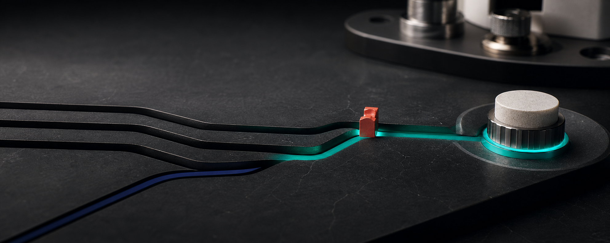

<div align="center">


<h1>JINSTONE · 径石</h1>

**Measurable edge inference systems on open RISC-V.**

径石从真实端侧工作负载出发，把可复现的瓶颈变成可集成的计算路径。

[System](#the-system) · [Evidence standard](#evidence-ladder) · [Current phase](#current-phase) · [Visual system](../docs/brand/README.md)

<br />



</div>

## Thesis

Most chip projects begin with an architecture and search for a reason to exist.
Jinstone begins with a workload, a physical decision loop, and a measurement
chain.

We qualify what fails on existing hardware. We isolate the bottleneck. Only
then do we move it into a RISC-V extension, FPGA primitive, coprocessor, or
future silicon block.

> **We do not start with silicon. We make silicon earn its place.**

The long-term wedge is narrow: power-constrained inference where routing,
quantized matrix work, irregular memory access, and local action latency decide
whether a system can remain at the edge.

## The system

| Stage | System layer | Output |
|---|---|---|
| **01 · Qualify** | Qualification Cell measures a complete sensor → model → action loop | Raw events, latency, power, quality, memory, startup, and failure evidence |
| **02 · Control** | Validation OS binds device identity, collectors, repeatability, and safety gates | Reproducible evidence bundle and a fail-closed claim decision |
| **03 · Accelerate** | Kernel Lab profiles only qualified bottlenecks on RISC-V and FPGA | A primitive with the same before/after workload and measurement protocol |
| **04 · Integrate** | Reference designs place the proven path back into a real edge system | An artifact another engineering team can run, inspect, and compare |

This is one vertical system. The benchmark, board agent, FPGA experiment, and
future chip are not separate demos; they must share identity, workload, and
evidence.


## Evidence ladder

Jinstone release language is determined by evidence level, not presentation
quality.

| Level | What it establishes | Claim boundary |
|---|---|---|
| `FIXTURE` | Parser, contracts, reports, and failure behavior execute correctly | No hardware or performance claim |
| `HOST` | A reproducible software baseline on an identified host | Not representative of an edge target |
| `BOARD` | A measured run on a bound physical target with trusted collectors | One device/runtime path only |
| `FPGA` | The architecture changes the same qualified workload under measurement | Not a tapeout or production-power claim |
| `SILICON` | A physical implementation produces repeatable measurements | Scope remains the published workload, process, and conditions |

Every result should carry the workload, device identity, source revision,
model/runtime hashes, raw log, collector identity, repeated-run statistics, and
an explicit claim boundary. A polished fixture stays a fixture.

## Engineering focus

- **Local decision loops** where privacy, connectivity, latency, or failure cost
  makes cloud-only execution structurally weak.
- **Open RISC-V control surfaces** that can be inspected, extended, and handed
  to an integration partner.
- **Routing and quantized compute hotspots** only when profiles show they are
  the limiting path.
- **Visible results**: completed actions, watts, milliseconds, errors, thermal
  behavior, memory use, and repeatability — not isolated kernel throughput.

## Current phase

Jinstone is building the qualification and control layers first. Software
contracts and offline evidence paths are under active validation; physical
board, FPGA, and silicon claims remain gated until their identities,
instruments, raw evidence, and repeated runs are bound together.

Public repositories will open artifact by artifact when they are replayable.
There is **no public tapeout claim** today.

## Release discipline

One release communicates one literal result:

```text
workload → target → measured change → evidence level → claim boundary
```

No benchmark without its baseline. No accelerator without the end-to-end path.
No green status from simulated evidence. No roadmap item presented as a result.


Design-partner conversations are welcome for real edge workloads with a
measurable action loop. Bring the workload, its operating constraints, and the
failure that matters.

---

<div align="center">

**JINSTONE · 径石**

*Measure the path. Build the silicon.*

Hong Kong

</div>
