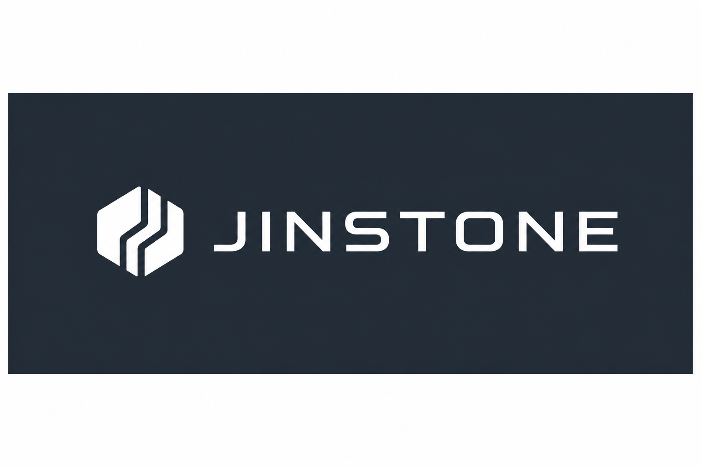
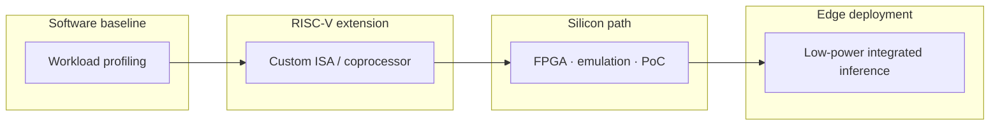

### Edge AI inference infrastructure on open RISC-V

**Custom paths for inference on silicon**

基于 RISC-V 开放 ISA 的端侧 AI 推理基础设施 — 软硬件协同设计

 

---

## The shift

Model architectures are changing faster than general-purpose silicon.

**Mixture-of-Experts**, sparse activation, and routing-heavy workloads expose a structural mismatch: cloud GPUs are optimized for dense matmul, not **expert selection, memory bandwidth, and integration at the edge**.

The next infrastructure layer is not another API wrapper. It is **co-designed hardware paths on an open ISA**.

---

## What Jinstone is

**Jinstone（径石）** builds edge AI inference infrastructure on **RISC-V** — from measured software baselines to custom extensions and integration-ready reference designs.

| 径 | Path — routing, expert selection, ISA-level control flow |
| 石 | Silicon — accelerators, co-processors, deployable IP |

Not a GPU vendor. Not an AGI app studio. **Infrastructure for inference where power, integration, and ownership matter.**

| Stage | Role |
|-------|------|
| **Measure** | Profile real workloads — MoE routing, matmul hotspots, memory bounds |
| **Extend** | Custom instructions, co-processors, and accelerator blocks on RISC-V |
| **Verify** | Simulation and FPGA bring-up with reproducible benchmarks |
| **Integrate** | Reference designs partners can evaluate and ship |

**Measure first. Extend where it counts. Ship paths, not slides.**

---

## Built different

| Status quo | Jinstone |
|------------|----------|
| Dense-GPU mindset for every new model | **Workload-first** — routing and sparsity drive the architecture |
| Closed, black-box accelerators | **Open ISA** — inspectable, extensible, partner-friendly |
| Slide-deck IP | **Reproducible baselines → verified extensions → PoC** |
| Cloud-only inference | **Edge-ready** — lower power, tighter integration |

---

## Principles

- **Open ISA, owned path** — RISC-V as the integration surface, not a marketing label  
- **Software leads hardware** — profile before you pipeline  
- **Sparse is the default** — MoE and activation sparsity are first-class design inputs  
- **Mature engineering** — ship measurable artifacts, not demo hype  

---

## Focus areas

| Area | Direction |
|------|-----------|
| **MoE routing** | Expert selection, gating, and memory-aware scheduling |
| **Matmul & tensor ops** | Hotspot acceleration without rebuilding a general GPU |
| **Custom instructions** | ISA extensions aligned to measured kernels |
| **Edge LLM inference** | Low-power, embeddable, less cloud dependency |
| **Verification stack** | ISA sim → FPGA — reproducible benchmark loops |

---

## Where we are

**Active R&D** across software baselines, RISC-V labs, and FPGA-oriented validation.

We are building like a silicon infrastructure team — **clear benchmarks, explicit extension contracts, and artifacts collaborators can run** — not like a benchmark chart factory.

Public labs and experiments live under **[FranklinNexus](https://github.com/FranklinNexus)** while core IP matures in this organization.

---

## Read more

| Resource | Link |
|----------|------|
| Founder labs & open experiments | [github.com/FranklinNexus](https://github.com/FranklinNexus) |
| Organization | [github.com/Jinstone-Limited](https://github.com/Jinstone-Limited) |

**Collaboration or design-partner inquiries** → open an issue in a public repo or reach out via GitHub profile.

---

## Open engineering

This organization publishes **research notes, design artifacts, and reference experiments** as they mature.

Select repositories may remain **private during active development**. **Follow [@Jinstone-Limited](https://github.com/Jinstone-Limited)** for public releases and partner-facing reference designs.

---

 

**JINSTONE** · *Custom paths for inference on silicon*

 

Hong Kong · 径石

